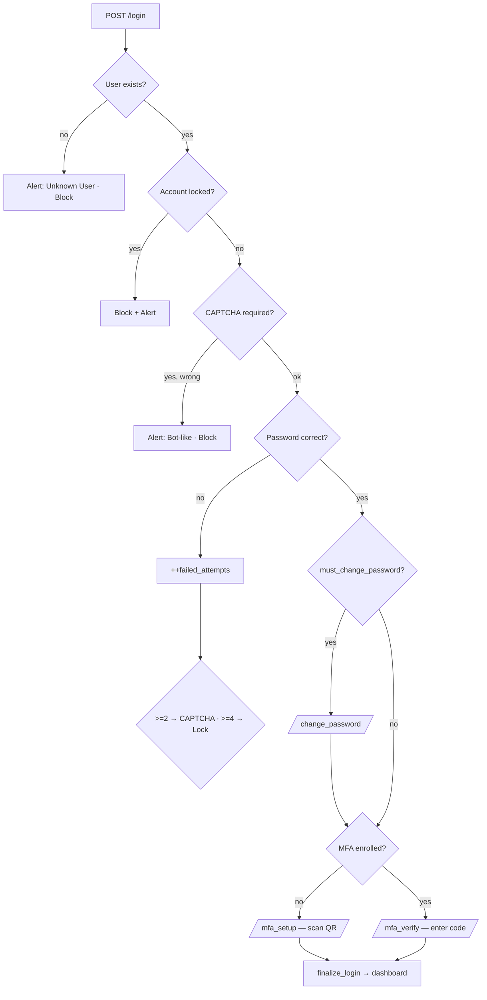

# Architecture — MGM Secure Guest System

## Layered design

```
┌─────────────────────────────────────────────────────────────┐
│  Presentation   Jinja2 templates (login, dashboards, MFA)    │
├─────────────────────────────────────────────────────────────┤
│  Edge security  Rate limiting · CSRF · Security headers       │
├─────────────────────────────────────────────────────────────┤
│  Application    Flask routes (app.py)                         │
│                 ├─ Authentication (password + risk scoring)   │
│                 ├─ MFA challenge (TOTP)                        │
│                 └─ RBAC (admin / staff / security)            │
├─────────────────────────────────────────────────────────────┤
│  Security svcs  risk_engine · anomaly_detector · honeypot     │
│                 validators · crypto · mfa                     │
├─────────────────────────────────────────────────────────────┤
│  Data           MongoDB — fragmented + encrypted storage      │
│                 guest_basic · guest_contact · guest_sensitive │
│                 users · alerts · login_logs · access_logs     │
└─────────────────────────────────────────────────────────────┘
```

## Authentication & MFA flow



## Data protection model

The same guest is **fragmented** across three collections so a single
compromised collection never yields a full profile:

| Collection        | Holds                        | Protection                    |
| ----------------- | ---------------------------- | ----------------------------- |
| `guest_basic`     | name, check-in/out           | Role-gated read               |
| `guest_contact`   | phone, email, address        | Masked for `staff` role       |
| `guest_sensitive` | ID proof (passport/Aadhaar)  | **Fernet encrypted at rest**  |

A `staff` user sees masked PII; `admin`/`security` see decrypted values.
A full DB dump still leaves ID proofs as ciphertext.

## Role-based access (strict separation)

Each role sees **only its own dashboard**; an attempt to reach another
role's panel is redirected and raises a privilege-escalation alert.
Some action pages are intentionally shared between roles.

| Route            | admin | staff | security |
| ---------------- | :---: | :---: | :------: |
| `/admin`         |  ✅   |  ❌   |    ❌    |
| `/staff`         |  ❌   |  ✅   |    ❌    |
| `/security` (SOC)|  ❌   |  ❌   |    ✅    |
| `/register_user` |  ✅   |  ❌   |    ✅    |
| `/unlock_user`   |  ✅   |  ❌   |    ✅    |
| `/add_guest`     |  ✅   |  ✅   |    ❌    |
| `/view_guests`   |  ✅   |  ✅   |    ✅    |

`/dashboard` is a role-neutral "Home" link that redirects each user to
their own dashboard, so shared pages never link toward a forbidden panel.

## Threat detection

| Mechanism             | Trigger                                   | Module                |
| --------------------- | ----------------------------------------- | --------------------- |
| Brute-force defense   | 2 fails → CAPTCHA, 4 fails → lock         | `app.py` + `risk_engine` |
| Honeypot trap         | Any access to `TRAP-001` record           | `honeypot`            |
| Insider-threat ML     | Isolation Forest on access behavior       | `anomaly_detector`    |
| Mass-extraction watch | ≥5 guest-record views per user            | `app.py`              |
| Privilege escalation  | Role accessing a route outside its scope  | `app.py` (RBAC)       |

Every event is written to the `alerts` collection with risk score, IP,
and user-agent, and surfaced on the Security dashboard.
